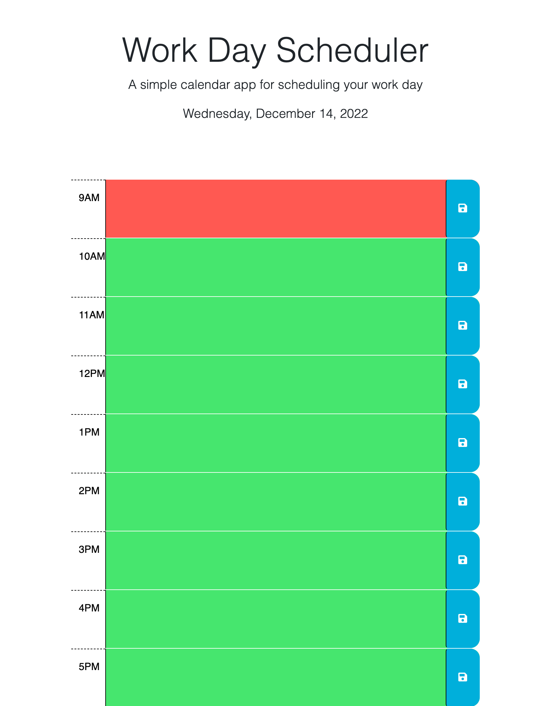

# Work Day Scheduler

This weeks challenge, we are to create a simple calendar application that allows a user to save events for each hour of the day. The calendar application will present a different color on the timeblock depending on the on the current hour. Past presents grey, red presents present and green presents the future.

### Screenshot

#### Deployment Link

https://joanavillajuan.github.io/day-scheduler/